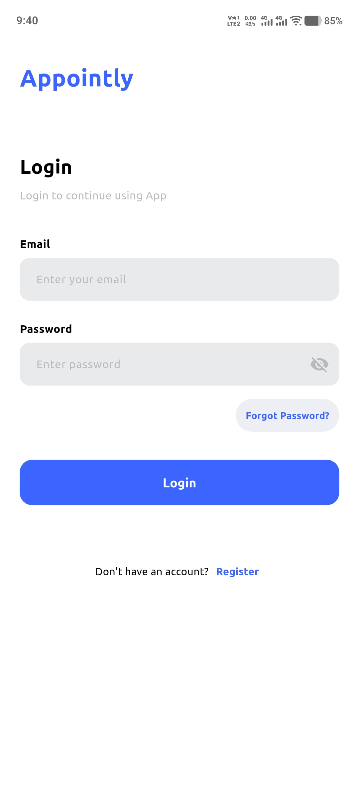
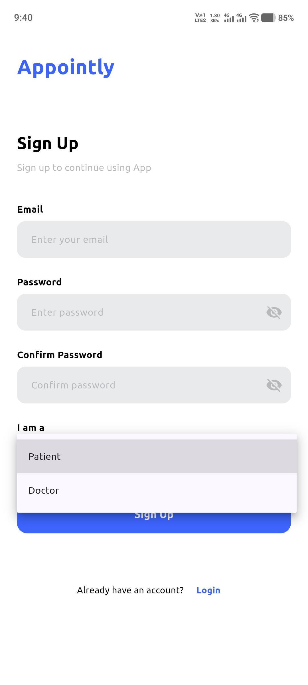
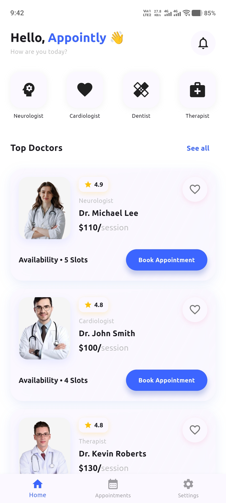

# MediSlot - Doctor Appointment Booking App

MediSlot is a modern, feature-rich Flutter application designed to simplify the process of booking medical appointments. It provides a seamless experience for patients to find doctors, book appointments, and manage their health schedule, while offering robust features like real-time notifications and secure authentication.

## 📸 Screenshots

### 🧑‍⚕️ Patient Mode

<p align="center">
  
  
  
  
  
  
  
  
  
  
  
</p>

### 🧑‍⚕️ Doctor Mode

<p align="center">
  
  
</p>

## 🚀 Key Features

*   **📱 Seamless Authentication**:
    *   Secure Email/Password and OTP-based Login/Sign-up.
    *   **Persistent Login**: Users stay logged in across app restarts.
    *   **Password Reset**: Deep linking integration allows users to reset their password directly within the app via email links.

*   **📅 Easy Appointment Booking**:
    *   Browse doctor profiles with detailed information (Rating, Price, Experience).
    *   Interactive calendar and time-slot selection.
    *   **Rescheduling**: Easily reschedule existing appointments with automatic slot management.

*   **🔔 Smart Notifications**:
    *   **Persistent**: Notifications are stored in Firestore and persist across sessions.
    *   **Dual Reminders**:
        *   🔔 **15-Minute Reminder**: Get notified before your appointment starts.
        *   ⏰ **On-Time Alert**: Receive an alert exactly when your appointment begins.
    *   **Dynamic Updates**: Rescheduling an appointment automatically updates all pending reminders.

*   **👨‍⚕️ Doctor Management**:
    *   Dynamic doctor listings fetched from Firestore.
    *   Filter doctors by category (Cardiology, Dentistry, Neurology, etc.).

*   **🎨 Enhancements**:
    *   Clean, modern UI compliant with Material Design.
    *   Profile management for patients.

## 🛠️ Technology Stack

*   **Framework**: [Flutter](https://flutter.dev/) (Dart)
*   **Backend**: [Firebase](https://firebase.google.com/)
    *   **Authentication**: User management and security.
    *   **Cloud Firestore**: NoSQL database for appointments, doctors, and notifications.
*   **State Management**: [Provider](https://pub.dev/packages/provider)
*   **Key Packages**:
    *   `flutter_local_notifications`: For scheduling and displaying local notifications.
    *   `table_calendar`: For the interactive booking calendar.
    *   `app_links`: For handling deep links (password reset).
    *   `google_maps_flutter`: Map integration (prepared).
    *   `timezone`: ensuring notifications fire at the correct local time.

## ⚙️ Getting Started

Follow these steps to set up the project locally.

### Prerequisites

*   **Flutter SDK**: [Install Flutter](https://docs.flutter.dev/get-started/install)
*   **Dart SDK**: Included with Flutter.
*   **Firebase Account**: You need a Firebase project.

### Installation

1.  **Clone the Repository**
    ```bash
    git clone https://github.com/Ammad-Younas/appointment_booking_app.git
    cd appointment_booking_app
    ```

2.  **Install Dependencies**
    ```bash
    flutter pub get
    ```

3.  **Firebase Configuration**
    *   This project uses `flutterfire_cli`.
    *   Run `flutterfire configure` to generate the `firebase_options.dart` file for your specific Firebase project.
    *   Ensure **Authentication** (Email/Password), **Firestore**, and **Storage** are enabled in your Firebase Console.
    *   For **Password Reset Deep Linking**:
        *   Add your Android Package Name (`com.example.appointment_booking_app`) to your Firebase Project settings.
        *   Ensure the SHA-1 and SHA-256 keys are added.

4.  **Run the App**
    ```bash
    flutter run
    ```

## 📂 Project Structure

```
lib/
├── main.dart                  # Entry point & App Configuration
├── firebase_options.dart      # Firebase Generated Config
├── services/                  # Business Logic & API calls (Auth, Notification, etc.)
├── src/
│   ├── views/
│   │   ├── screens/           # Full-screen widgets (Login, Home, Booking)
│   │   └── widgets/           # Reusable UI components
│   └── ...
└── utils/                     # Constants, Themes, and Helper functions
```

## 🤝 Contributing

Contributions are welcome! Please fork the repository and create a pull request with your changes.

## 📄 License

This project is licensed under the MIT License - see the [LICENSE](LICENSE) file for details.
